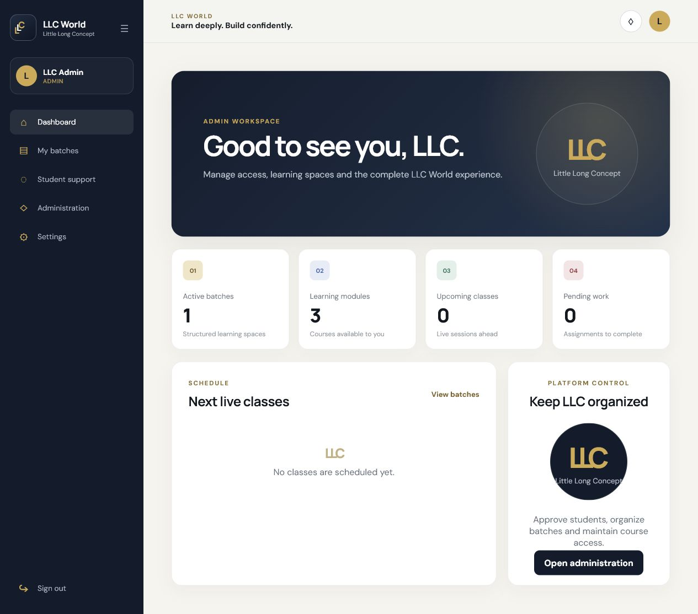

# Coding Seekho LMS

Coding Seekho LMS is the full-stack repository for **LLC World (Little Long
Concept)**, a private learning platform used by students, teachers, and
administrators.

## Features

- Role-based access for administrators, teachers, and students
- Student registration with admin-controlled batch approval
- Multiple batch memberships and fee-verification status
- Batch-only group conversations and private institution support
- Google Meet and Zoom lecture scheduling
- Join-based attendance recording
- Assignment publishing, file submission, grading, and feedback
- In-app notifications and optional email delivery
- Responsive desktop and mobile interface

## Product Preview



## Tech Stack

| Area | Technology |
| --- | --- |
| Frontend | React 19, React Router 6, Create React App |
| Backend | Java 17+, Spring Boot 3.5, Spring Security, Spring Data JPA |
| Authentication | JWT and BCrypt |
| Database | PostgreSQL 15+ |
| Testing | JUnit, Spring Boot Test, H2, React Testing Library |

## Project Structure

```text
coding-seekho-lms/
|-- coding-seekho-update/       React frontend
|   |-- public/
|   `-- src/
|       |-- components/
|       `-- pages/
|-- backend/
|   `-- lms-backend/            Spring Boot REST API
|       `-- src/
|           |-- main/
|           `-- test/
|-- .gitignore
`-- README.md
```

## Local Setup

### 1. Database

Create a PostgreSQL database:

```sql
CREATE DATABASE coding_seekho_lms;
```

### 2. Backend

Configure these environment variables in IntelliJ's
`BackendApplication` run configuration:

```text
DB_URL=jdbc:postgresql://localhost:5432/coding_seekho_lms
DB_USERNAME=postgres
DB_PASSWORD=your-local-database-password
JWT_SECRET=replace-with-a-long-random-secret-of-at-least-32-characters
BOOTSTRAP_ADMIN_NAME=LLC Administrator
BOOTSTRAP_ADMIN_EMAIL=your-admin-email
BOOTSTRAP_ADMIN_PASSWORD=your-unique-12-plus-character-password
FRONTEND_URL=http://localhost:3000
```

Run `BackendApplication.java` from IntelliJ, or:

```powershell
cd ".\backend\lms-backend"
.\mvnw.cmd spring-boot:run
```

The bootstrap administrator is created only when the three
`BOOTSTRAP_ADMIN_*` values are supplied. Remove the password from the run
configuration after the account has been created.

### 3. Frontend

```powershell
cd ".\coding-seekho-update"
npm.cmd install
npm.cmd start
```

Open `http://localhost:3000`. Students can create their own accounts; elevated
roles are assigned by an administrator.

See the frontend and backend `.env.example` files for the complete
configuration reference. Real `.env` files are ignored by Git.

## API Overview

| Method | Endpoint | Purpose |
| --- | --- | --- |
| `POST` | `/api/auth/register` | Register a student |
| `POST` | `/api/auth/login` | Authenticate and receive a JWT |
| `GET` | `/api/auth/me` | Read the current identity |
| `GET` | `/api/public/courses` | View the public course catalog |
| `GET` | `/api/dashboard` | Load role-aware dashboard data |
| `GET` | `/api/batches` | List accessible batches |
| `GET/POST` | `/api/chat/batches/{batchId}` | Read or send batch messages |
| `GET/POST` | `/api/meetings` | Manage live classes |
| `GET/POST` | `/api/assignments` | Manage assignments and submissions |
| `GET/POST` | `/api/support` | Institution support conversation |
| `GET/POST/PUT` | `/api/admin/**` | Manage users, batches, courses, and access |

Protected endpoints require:

```http
Authorization: Bearer <jwt-token>
```

## Tests

```powershell
cd ".\backend\lms-backend"
.\mvnw.cmd test

cd "..\..\coding-seekho-update"
$env:CI="true"
npm.cmd test -- --watchAll=false
npm.cmd run build
```

## Branch Workflow

- `main`: stable checkpoints only
- `dev`: active integration branch
- `feature/<name>`: isolated product features
- `fix/<name>`: bug fixes

Open pull requests into `dev`. Merge tested release checkpoints from `dev` into
`main`.

## Known Limitations

- Google Meet and Zoom rooms are created in the provider UI and their links are
  published through LLC World. Direct room creation requires provider OAuth.
- Email delivery requires SMTP configuration.
- Deployment, automated backups, and CI/CD are planned after local validation.

## Roadmap

- Provider OAuth for direct meeting creation
- Production deployment and managed PostgreSQL
- CI checks for frontend and backend
- Audit logs and reporting
- Expanded automated API and browser tests
